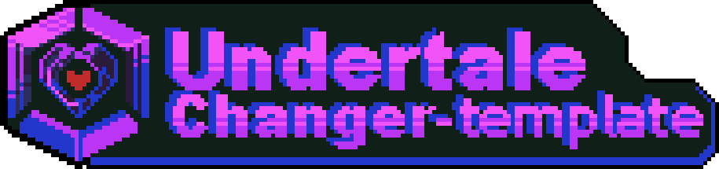

# 下载前先看看我！！！！
你正在浏览的是 **Undertale-Changer-Template (UCT)** 的 **[Develop](https://github.com/Bli-AIk/Undertale-Changer-Template/tree/develop)** 分支，该分支目前持续保持更新状态，且更新频繁。

截至 **2024 年 7 月**的内容存档目前存储在 **[Main](https://github.com/Bli-AIk/Undertale-Changer-Template/tree/main)** 分支。如果你想使用一个更加稳定（存疑）的版本，建议切换到该分支。

当前 **UCT** 仍处于**半成品**阶段，因此请勿将此版本用于游戏制作。

**此版本仅供学习使用，敬请期待 UCT 的后续更新。**

你可以通过[**CHANGELOG_zh-CN.md**](CHANGELOG_zh-CN.md)查看UCT目前的更新日志，也可以查阅[**PLAN_zh-CN.md**](PLAN_zh-CN.md)来了解UCT的更新计划。

# Undertale-Changer-Template

  

一个基于[**Unity引擎**](https://unity.com)的[**UNDERTALE**](https://undertale.com)同人游戏模板。

| [English](readme.md) | 简体中文 | [繁體中文](README_zh-TW.md) |
|:---------------------:|:---------------------------:|:---------------------------:|

## 内容目录

- [背景](#背景)
- [简介](#简介)
- [使用方法](#使用方法)
- [Wiki](#Wiki)
- [依赖项](#依赖项)
- [贡献者](#贡献者)
- [许可证](#许可证)

## 背景
该项目始于2022年初，由我（Bli_AIk）独自完成。

在此之前，我创建了一个简单的Undertale同人战斗模板（未发布），并使用它来开发一个游戏项目。

然而，我对旧模板的结果不满意。因此，我决定创建一个能够生成完整同人游戏的模板。

这标志着它千里之行的第一步。

## 简介
### Undertale Changer Template由Bli_AIk制作。

该项目使用了通用渲染管线（URP）。

目前，该模板包括以下内容：

标题场景，重新命名场景，世界场景，战斗场景，游戏结束场景。

包含外部语言包系统。

您可以使用此模板创建自己的游戏或修改原始代码。

但请确保在显眼的位置醒目显示“Undertale-Changer-Template”。

## 使用方法
1. 确保您已购买并玩过Undertale，您可以点击[此处](https://undertale.com/)购买。
2. 下载并解压缩到您喜欢的文件路径内，最好选择完全以英语命名的路径。
3. 将文件导入Unity。
4. 在Unity中打开项目，然后您可以开始使用了。

目前兼容的Unity编辑器版本：2021.3.15f1 LTS

建议使用此版本或更高版本以获得最佳体验。

但不建议使用2022版本，否则模板可能会出现问题。

## Wiki

[Wiki](https://github.com/Bli-AIk/Undertale-Changer-Template/wiki/Home%E2%80%90zh_CN)

（请注意，此Wiki是根据旧版的UCT而编写的，它可能与当前版本的部分内容存在差异）

## 依赖项
- [Clipper2](https://github.com/AngusJohnson/Clipper2)
- [DOTween](https://dotween.demigiant.com/)
- [LibTessDotNet](https://github.com/speps/LibTessDotNet)
- [Live2D](https://www.live2d.com/cubism/download/viewer-unity/)
- [TextMesh Pro](https://docs.unity3d.com/Packages/com.unity.textmeshpro@2.1/manual/index.html)
- [More Effective Coroutines](http://trinary.tech/category/mec/)
- [Fusion Pixel Font](https://github.com/TakWolf/fusion-pixel-font)
- [RiderFlow](https://www.jetbrains.com/riderflow/)
- [Pinyin4NET](https://github.com/hyjiacan/Pinyin4NET)
- [NuGetForUnity](https://github.com/GlitchEnzo/NuGetForUnity)
- [chineseStroke](https://github.com/WTree/chineseStroke)
- [Alchemy](https://github.com/AnnulusGames/Alchemy)
- [UnityTimer](https://github.com/akbiggs/UnityTimer)

以上库/插件的贡献者们为本项目提供了优秀的工具和技术支持，衷心感谢你们！

*另注：由于项目开发时间较长且未从一开始记录依赖项，可能存在遗漏，无意侵权。若有遗漏，请通过Issue告知，谢谢！*

## 贡献者
以下人员为本项目做出了贡献。

**衷心感谢你们每一个人！🎔**

如果你发现Bug、想要修复问题或者改进此项目，请阅读 **[贡献指南](CONTRIBUTING_zh-CN.md)**。

## 许可证

[GNU通用公共许可证 v3.0(GNU General Public License v3.0)](../main/LICENSE)
